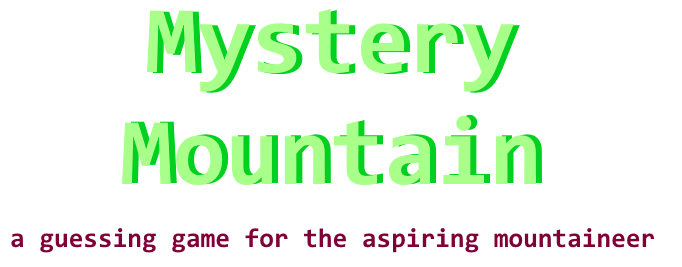

<p align="center">
  
</p>

---
Collaborators:
- June Lee jhl66@sfu.ca
- Fazal Rehman fra22@sfu.ca
- Danny Yu dya46@sfu.ca
- Zaid Arshad zaa10@sfu.ca

Built using Python, kivy, kivyMD and WebSocket API
Mystery Mountain is a guessing game for the mountainous adept who wish to hone their mountain skills. 

Gameplay consists of being 5 rounds. In each round you are given a Mountain Peak and its corresponding image. You must then guess three <strong>very important</strong> pieces of information:

- **A**ltitude of a given Mountain
- **P**rominence of a Mountain
- **I**solation between next closest Mountain

You are then given a score out of 10 for the correctness of your guess in each round.
At the end of the round you will recieve a final score out of 50, which will be updated to a local server and a leaderboard of top players will be displayed!


## Tech Stack

Our program is coded using Python, We utilise libraries from KivyMD for UI, and WebSocket for Server-Client Communication
We used OOP to create the logic of the project and designed special algorithms for score calculations

### Running Mystery Mountain

To install Mystery Mountain, please follow below:


Installing and running program
```bash 
pip install -r requirements.txt
```

Running the server
```
python server.py
```

Testing the server
```
python -m websockets ws://YOUR_IP:CHOSEN_PORT/

{"command":"send_score", "name":"june", "score":90}
{"command":"send_score", "name":"justin", "score":20}
{"command":"send_score", "name":"zaid", "score":100}
{"command":"send_score", "name":"danny", "score":90}
{"command":"send_score", "name":"fazal", "score":20}
{"command":"get_top_scores"}
```

simply run frontend.py and continue!
